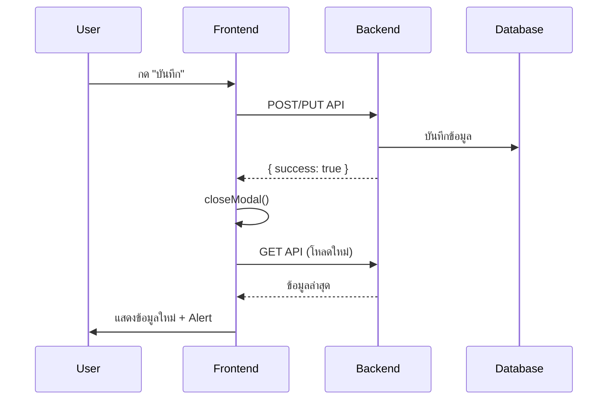

# ระบบ Auto-Update หลังแก้ไขข้อมูล

## ✅ ฟีเจอร์ที่เพิ่มแล้ว

เมื่ออาจารย์แก้ไข/เพิ่ม/ลบข้อมูล **เว็บจะอัปเดตอัตโนมัติทันที** โดยไม่ต้อง refresh หน้า

---

## 🎯 หน้าที่มี Auto-Update

### 1. **ตารางสอน** (`/teacher`)
- ✅ เพิ่มวิชา → โหลดตารางใหม่ทันที + แจ้งเตือน "✅ บันทึกสำเร็จ!"
- ✅ แก้ไขวิชา → อัปเดตตารางทันที + แจ้งเตือน
- ✅ ลบวิชา → รีเฟรชตารางทันที + แจ้งเตือน "✅ ลบสำเร็จ!"

### 2. **จัดการผู้ใช้** (`/admin.html`)

**อาจารย์:**
- ✅ เพิ่มอาจารย์ → รีเฟรชรายการทันที + แจ้งเตือน
- ✅ แก้ไขอาจารย์ → อัปเดตข้อมูลทันที + แจ้งเตือน
- ✅ ลบอาจารย์ → รีเฟรชรายการทันที + แจ้งเตือน

**นักศึกษา:**
- ✅ เพิ่มนักศึกษา → รีเฟรชรายการทันที + แจ้งเตือน
- ✅ แก้ไขนักศึกษา → อัปเดตข้อมูลทันที + แจ้งเตือน
- ✅ ลบนักศึกษา → รีเฟรชรายการทันที + แจ้งเตือน

### 3. **โปรไฟล์** (`/profile.html`)
- ✅ บันทึกโปรไฟล์ → Redirect ไป Dashboard (เห็นข้อมูลใหม่)
- ✅ อัปโหลดรูป → บันทึก + Redirect

---

## 🔄 วิธีการทำงาน

### เทคนิค: AJAX + Auto Reload

```javascript
// เมื่อบันทึกสำเร็จ
if (result.success) {
    closeModal();            // ปิด dialog
    await loadData();        // โหลดข้อมูลใหม่จาก API
    alert('✅ สำเร็จ!');     // แจ้งเตือน
}
```

**ไม่ต้อง:**
- ❌ Refresh ทั้งหน้า (F5)
- ❌ กด back/forward
- ❌ รอโหลดนาน

**แค่:**
- ✅ กด Save → เห็นข้อมูลใหม่ทันที!

---

## 💡 ความแตกต่างจากก่อน

### ก่อนหน้า:
```
1. กด "บันทึก"
2. ??????
3. ต้องกด F5 เพื่อเห็นข้อมูลใหม่
```

### ตอนนี้:
```
1. กด "บันทึก"
2. ✅ เห็น Alert "สำเร็จ!"
3. ✅ ข้อมูลอัปเดตทันที!
```

---

## 🌐 เหมือนเว็บสมัยใหม่

**เว็บที่ใช้เทคนิคเดียวกัน:**
- Gmail (อ่านเมลแล้วหายจาก inbox ทันที)
- Facebook (โพสต์แล้วเห็นทันที)
- Twitter/X (Like แล้วเปลี่ยนสีทันที)
- TeachMap (แก้ไขแล้ว อัปเดตทันที!)

---

## 📊 เทคนิคที่ใช้

1. **Async/Await** - โหลดข้อมูลแบบ asynchronous
2. **Fetch API** - ส่ง request ไปหา backend
3. **DOM Update** - อัปเดต HTML โดยไม่ reload หน้า
4. **User Feedback** - Alert บอกสถานะ (สำเร็จ/ล้มเหลว)

---

## 🔧 การทำงานเบื้องหลัง



---

## ⚡ Performance

- **รวดเร็ว:** โหลดแค่ข้อมูลที่เปลี่ยน (ไม่ reload ทั้งหน้า)
- **Smooth:** ไม่มีกระตุก/กระพริบ
- **Real-time:** เห็นผลทันทีที่บันทึก

---

## 🎨 UX ที่ดีขึ้น

1. **Immediate Feedback** 
   - เห็นผลทันที → รู้ว่าบันทึกได้
   
2. **No Confusion**
   - Alert ชัดเจน → ไม่งง
   
3. **Modern Feel**
   - ลื่นไหล เหมือนแอพมือถือ

---

## 🆕 Next Steps (อนาคต)

ถ้าอยากเพิ่มเติม:

- **Toast Notifications** แทน Alert (สวยกว่า)
- **Loading Spinner** ขณะโหลด
- **Optimistic Updates** (อัปเดตก่อน รอ API ทีหลัง)
- **WebSocket** (Real-time sync หลายคน)

---

## ✅ สรุป

**ตอนนี้ TeachMap มี Auto-Update เหมือนเว็บสมัยใหม่แล้ว!**

- ไม่ต้องกด F5
- ไม่ต้องรอ
- ข้อมูลอัปเดตทันที
- มี Feedback ชัดเจน

🎉 **ใช้งานง่าย ลื่นไหล เหมือนเว็บระดับโลก!**
